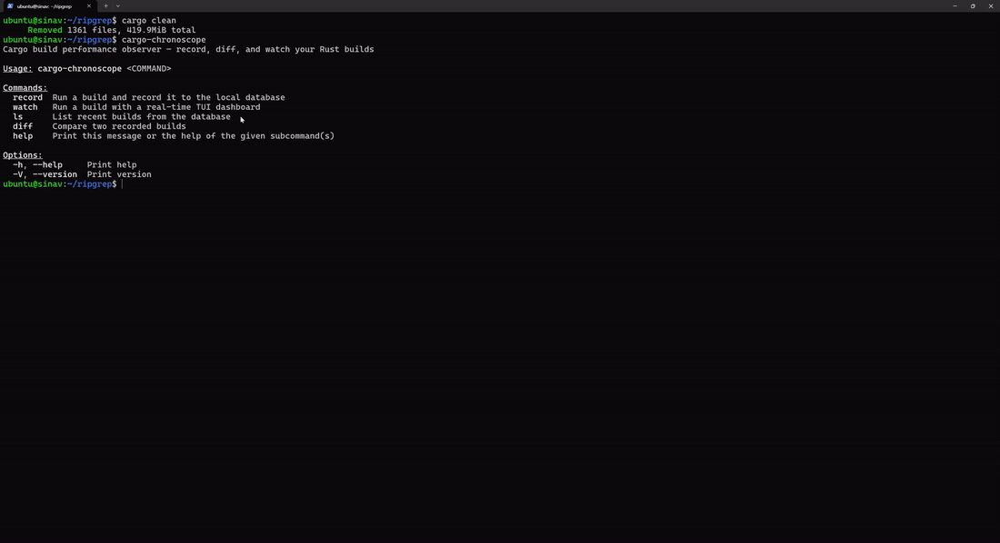

# cargo-chronoscope

> Cargo build performance observer — record, diff, and watch your Rust builds.

[](https://crates.io/crates/cargo-chronoscope)
[](LICENSE)

`cargo-chronoscope` consumes Cargo's machine-readable build event stream, persists
each build to a local SQLite database, and gives you four ways to look at the
results: a real-time TUI dashboard while a build is running, a list of past
builds, a diff between any two builds, and a baseline-aware anomaly classifier
that flags crates compiling slower or faster than usual.

It addresses a corner of the Rust project's [2025 H2 goal "Prototype Cargo
build analysis"][rust-goal] from the outside — the part where an external tool
analyses historical trends.

[rust-goal]: https://rust-lang.github.io/rust-project-goals/2025h2/cargo-build-analysis.html



## Features

| Command | What it does |
|---|---|
| `cargo-chronoscope record [-- <cargo args>]` | Run a `cargo build`, record every compilation event to the local database. |
| `cargo-chronoscope watch [-- <cargo args>]`  | Same as `record`, plus a live ratatui dashboard showing active crates, anomaly verdicts, and CPU/memory. |
| `cargo-chronoscope ls [--last N]`            | List the most recent builds (default: 10). |
| `cargo-chronoscope diff <before> <after>`    | Compare two recorded builds: total time, per-crate movers, and side-by-side critical paths. |

Other things it does:

- **Anomaly classification** — every finished crate is compared against its
  historical mean ± 2σ and labelled `slower` / `faster` / `normal`. In the
  TUI, in-progress crates that have already exceeded the upper bound are
  flagged live.
- **Cancellation-aware recording** — pressing `q` or `Ctrl-C` mid-build
  discards the partial data instead of polluting your baselines with a
  half-recorded build.
- **Concurrent-safe storage** — multiple `cargo-chronoscope` processes can share
  the same database; SQLite's `busy_timeout` and a transactional migration
  serialise the few moments where it matters.

## Installation

```bash
cargo install cargo-chronoscope
```

This puts `cargo-chronoscope` on your `PATH` (typically `~/.cargo/bin`).

### From source

```bash
git clone https://github.com/ymw0407/cargo-chronoscope.git
cd cargo-chronoscope
cargo install --path .
```

## Quick start

```bash
# Pick a Rust project to observe.
cd ~/your-rust-project

# Watch a build live.
cargo clean
cargo-chronoscope watch

# Or record without a UI, then inspect later.
cargo clean
cargo-chronoscope record

cargo-chronoscope ls
cargo-chronoscope diff 1 2
```

`cargo-chronoscope` runs `cargo build` in the current directory and stores its
data in `./.cargo-chronoscope/history.db` (SQLite, WAL mode). Add this directory
to your `.gitignore`:

```gitignore
.cargo-chronoscope/
```

## Usage

### `record` — store a build for later analysis

```bash
cargo-chronoscope record                   # cargo build
cargo-chronoscope record -- --release      # cargo build --release
cargo-chronoscope record -- -p my_crate    # cargo build -p my_crate
```

Anything after `--` is forwarded verbatim to `cargo build`. On success it
prints `Build #N recorded.` On `Ctrl-C` the partial row is deleted and you
get `Build interrupted — not recorded.` instead.

### `watch` — record + live TUI dashboard

```bash
cargo-chronoscope watch
cargo-chronoscope watch -- --release
```

```
┌─ cargo-chronoscope ───────────────────────────────────────┐
│ Build #5 (release) • commit abc1234 • elapsed 0:28   │
│ 142 crates compiled                                  │
├─ Active compilations ────────────────────────────────┤
│  ▶ serde_derive    12.4s   ⚠ slower                  │
│  ▶ syn              8.1s   · normal                  │
├─ Recently finished (last 5) ─────────────────────────┤
│  ✓ proc-macro2      5.8s   ↓ faster                  │
├─ System  [q] quit  [Ctrl-C] interrupt ───────────────┤
│  CPU: 75.5%   Memory: 4.0 GiB / 16.0 GiB             │
└──────────────────────────────────────────────────────┘
```

Exit keys: `q`, `Q`, or `Ctrl-C`. After the build finishes, the final frame
stays on screen until you press a key — convenient when the build was a fast
cache hit.

> Run from a real terminal (iTerm2 / Terminal.app), not an IDE-integrated
> terminal, for the best raw-mode behaviour. The dashboard restores the
> terminal on panic via a RAII guard, but `reset` will recover it manually
> if anything ever leaks.

### `ls` — list builds

```bash
cargo-chronoscope ls
cargo-chronoscope ls --last 30
```

```
ID     Started              Profile  Duration   Status
------------------------------------------------------------
#3     2026-05-03T01:31:14  release  1:32       ok
#2     2026-05-03T01:29:48  release  1:28       ok
#1     2026-05-03T01:13:41  dev      0:42       FAIL
```

### `diff` — compare two builds

```bash
cargo-chronoscope diff 1 2
```

```
Build #1 → Build #2
  Total: 0:42 → 1:28 (+0:46, +109.5%)

  ▲ syn               1.20s → 2.45s (+1.25s, +104.2%)
  ▼ proc-macro2       0.80s → 0.55s (-0.25s, -31.3%)
  + serde-derive (new) 0.92s
  - lazy_static (gone) 0.05s
  … 137 crates unchanged

Critical path: 14 → 11 nodes (-3)

    #  before              after
  ───  ──────────────────  ──────────────────
    1  cfg_if              memchr
    2  equivalent          bytes
    3  pin_project_lite    autocfg
    4  unicode_ident       shlex
    5  foldhash            foldhash             ✓
    ...

  removed from path: scopeguard, version_check, ryu
```

Markers:
- `▲` / `▼` — crate got slower / faster
- `+` / `-` — crate added / removed from this build
- `✓` — same crate at the same critical-path position
- `…` — unchanged crates collapsed into a count

## Use as a GitHub Action

The repository ships a composite GitHub Action so any Rust project can
add build-performance tracking with one `uses:` step. Each push to your
baseline branch records a build and updates a cached history database;
each pull request records a build and posts (or updates in place) a
sticky comment with the diff against the baseline.

### Recommended setup (works on PRs from forks)

GitHub forces the `GITHUB_TOKEN` of any `pull_request` workflow run from
a fork to be read-only, regardless of the workflow's `permissions:`
block. A composite action cannot work around this from inside the same
job, so to make the sticky comment land on fork PRs the report is
uploaded as an artifact and a sibling workflow on `workflow_run` posts
it from base-repo context.

Drop both of these into `.github/workflows/`:

```yaml
# .github/workflows/build-perf.yml
name: Build performance

on:
  push:
    branches: [main]
  pull_request:
    branches: [main]

jobs:
  measure:
    runs-on: ubuntu-latest
    permissions:
      contents: read
    steps:
      - uses: actions/checkout@v4
      - uses: dtolnay/rust-toolchain@stable

      - uses: ymw0407/cargo-chronoscope@action-v1
        with:
          version: '0.1.8'
          cargo-args: '--release'
          baseline-ref: 'main'
          comment: 'false'           # let the companion workflow post
          upload-artifact: 'true'    # hand off the report as an artifact
```

```yaml
# .github/workflows/perf-comment.yml
name: Build performance comment

on:
  workflow_run:
    workflows: ["Build performance"]
    types: [completed]

jobs:
  comment:
    runs-on: ubuntu-latest
    if: >-
      github.event.workflow_run.event == 'pull_request' &&
      github.event.workflow_run.conclusion == 'success'
    permissions:
      pull-requests: write
      actions: read
    steps:
      - uses: actions/download-artifact@v4
        with:
          name: perf-report
          run-id: ${{ github.event.workflow_run.id }}
          github-token: ${{ github.token }}
          path: ./perf-artifact
      # See examples/ci/perf-comment.yml for the validation + posting steps.
```

The full companion (with PR-number validation and the sticky-comment
posting logic) lives at
[`examples/ci/perf-comment.yml`](examples/ci/perf-comment.yml). Both
files are copy-pasteable as-is.

### Simpler setup (single workflow, same-repo PRs only)

If your repository never receives PRs from forks, you can skip the
companion workflow and let the action post the comment directly:

```yaml
jobs:
  measure:
    runs-on: ubuntu-latest
    permissions:
      contents: read
      pull-requests: write          # required for the in-step comment
    steps:
      - uses: actions/checkout@v4
      - uses: dtolnay/rust-toolchain@stable
      - uses: ymw0407/cargo-chronoscope@action-v1
        with:
          version: '0.1.8'
          comment: 'true'           # action posts the comment itself
```

This will silently skip the comment step on any forked-PR run.

### Tags

Release tags follow two namespaces:

| Tag | Purpose | Example pin |
|---|---|---|
| `vX.Y.Z`         | Binary release on crates.io. Used by `cargo install`. | `cargo install cargo-chronoscope --version 0.1.8` |
| `action-vN`      | Moving major tag for the GitHub Action — points at the latest backward-compatible release. | `uses: ymw0407/cargo-chronoscope@action-v1` |
| `action-vN.M.P`  | Immutable point release for the action.              | `uses: ymw0407/cargo-chronoscope@action-v1.0.4` |

### Action inputs

| Input              | Default            | Description |
|--------------------|--------------------|-------------|
| `version`          | `0.1.8`            | crate version installed via `cargo install`. Use a concrete version for reproducibility, or `latest`. |
| `cargo-args`       | `--release`        | Forwarded verbatim to `cargo build`. |
| `baseline-ref`     | `main`             | Branch whose cached DB is the baseline. Only pushes to this ref update the cache. |
| `cache-key-prefix` | `chronoscope-db`   | Prefix for the GitHub Actions cache key. |
| `comment`          | `true`             | Post or update a sticky PR comment from inside this job. Silently fails on fork PRs — see the recommended setup above. |
| `upload-artifact`  | `false`            | Upload the report and PR number as an artifact named `perf-report` for the companion `workflow_run` workflow. |
| `github-token`     | `${{ github.token }}` | Token used for the in-step comment path. |

### Action outputs

| Output | Description |
|---|---|
| `build-id`     | The chronoscope build ID assigned to this run. |
| `report-path`  | Path (relative to the workspace) of the rendered Markdown diff. |

> Do **not** run `Swatinem/rust-cache` on the same job — a warm `target/`
> directory short-circuits compilation and erases the per-crate timing
> signal that chronoscope measures.

Copy-pasteable reference workflows live at
[`examples/ci/build-perf.yml`](examples/ci/build-perf.yml) and
[`examples/ci/perf-comment.yml`](examples/ci/perf-comment.yml).

## How it works

```
              ┌──────────┐    JSON     ┌─────────┐
   cargo ────►│Supervisor│────lines───►│ Parser  │
   (stdout +  └──────────┘   (mpsc)    └─────────┘
    stderr)                                 │
                                       BuildEvent
                                            │
                  ┌─────────────────────────┴─────────────┐
                  │                                       │
            ┌─────▼─────┐                          ┌──────▼─────┐
            │   Broker  │ (watch mode only)        │  Persister │
            └─────┬─────┘                          └──────┬─────┘
                  │                                       │
              ┌───┴───┐                                ┌──▼──┐
              │ TUI   │                                │ DB  │
              └───────┘                                └─────┘
```

- **Supervisor** spawns `cargo build --message-format=json-render-diagnostics`
  and merges its stdout (JSON) and stderr (`Compiling foo v0.1.0` progress
  lines) into a single line stream.
- **Parser** turns that stream into typed `BuildEvent`s. The `Compiling` lines
  give per-crate start times; the `compiler-artifact` JSON gives per-crate end
  times.
- **Persister** writes each event to SQLite via the `BuildRepository` trait.
- **Broker** (watch mode only) fans events out to multiple subscribers — the
  persister and the TUI — without backpressuring either.
- **TUI** consumes events at ~60 fps, looks up baselines via the repository,
  and renders the dashboard.
- **Anomaly** module classifies durations against a baseline (mean ± `n·σ`).

## Database schema

A single SQLite file at `<workspace>/.cargo-chronoscope/history.db`:

```
builds
  id, started_at, finished_at, commit_hash, cargo_args,
  profile, success, total_duration_ms

crate_compilations
  id, build_id, crate_name, crate_version, kind,
  started_at, finished_at, duration_ms
```

WAL mode is enabled. `crate_compilations.build_id` references `builds.id`
(no `ON DELETE CASCADE` — `delete_build` removes both rows in one
transaction).

You can query the database directly with `sqlite3 .cargo-chronoscope/history.db`
if you want.

## Status

This project is under active development.

Current release CI builds prebuilt binaries for:

- Linux (x86_64-unknown-linux-gnu)
- macOS (x86_64-apple-darwin) — cross-compiled from the Apple Silicon runner
- macOS (aarch64-apple-darwin)
- Windows (x86_64-pc-windows-msvc)

`cargo binstall cargo-chronoscope` resolves the matching archive per
host. On Windows specifically, the binstall path avoids the Smart App
Control / WDAC blocks that source-builds (`cargo install`) hit when
cargo's temporary build-script `.exe` files run from a sandbox-flagged
location.

See the [release workflow](.github/workflows/release.yml) and the
[Releases page](https://github.com/ymw0407/cargo-chronoscope/releases)
for the latest artifacts.

Known gaps:

- Windows is freshly added to the release matrix; first user-facing
  `binstall` test happens at the next tagged release.
- `cargo --timings` integration is not yet exposed (cargo's own per-crate
  timing report could feed the same database).
- `anomaly` thresholds are not configurable from the CLI (hardcoded to 2σ).

See [issues](https://github.com/ymw0407/cargo-chronoscope/issues) for the
prioritised list.

## Contributing

PRs welcome. Before opening one, please run:

```bash
cargo fmt --check
cargo clippy -- -D warnings
cargo test
```

Conventional Commits format (`feat(scope): …`, `fix(scope): …`). Module
scopes: `model`, `cli`, `supervisor`, `parser`, `persist`, `diff`, `broker`,
`anomaly`, `tui`, `main`.

For the historical design notes, role split, and concurrency analysis from
the planning phase, see [`docs/internal/`](docs/internal/).

## License

MIT — see [LICENSE](LICENSE).
